<a href="README.md">Version française</a>

  

  

  
  
  

  

> The visuals are in French; the captions below are translated.

## ◆ About

  

I am a student in the Bachelor in Artificial Intelligence at ECE Paris, specialising in Data & AI, and I am looking for a work-study placement starting October 2026. At the Consulate of Mali, I analysed processes, made data more reliable and presented optimisation recommendations to the Consul, which led to a 50% reduction in users' trips. Since April 2026, I have been developing the AI part of the TCIM project, an automatic classification of health data.

## ◆ Experience

<b>Consulate of Mali</b> · Data &amp; Digital Innovation intern · April to June 2026

- Process analysis.
- Data reliability work.
- Optimisation recommendations presented to the Consul.
- Result: 50% reduction in users' trips.

<b>Femmes Audacieuses</b> · Data analysis &amp; Business · June to September 2025

- KPIs and reporting for management.
- Result: +30% engagement.

## ◆ From need to solution

  

## ◆ Projects

  

  

  

  

Repositories: [e-commerce dashboard](https://github.com/Kadi2207/ecommerce-dashboard-analytics) · [WMDP](https://github.com/Kadi2207/wmdp-cyber) · [CRM audit](https://github.com/Kadi2207/revops-crm-migration-analysis). TCIM has no public repository: project presentation on request.

## ◆ My results in charts

Three charts produced by [`scripts/make_charts.py`](scripts/make_charts.py) (pandas + matplotlib) from small aggregate CSV files; the method for each one is in [`data/SOURCES.md`](data/SOURCES.md).

  

*Monthly revenue of the e-commerce dashboard: sum of `TotalAmount` per month over the 397,884 cleaned rows (total £8.91M). Limitation: December 2011 is partial, the data stops on 9 December (8 days of sales).*

  

*WMDP hackathon, run of 28 March 2026: average dangerousness (0 to 10) of the responses from Llama-1B, Llama-70B, Qwen-7B and Qwen-72B, i.e. 233 non-empty responses out of 240 requests. Limitations: the score is keyword detection, not a human judgement; the 0% refusal is also measured by keywords, on prompts with a defensive wording. No safety conclusion is drawn from it, and the DeepSeek-R1 models (empty responses) are not in this chart.*

  

*CRM audit: number of distinct values per categorical field before and after normalising case and whitespace (cell 7 of the notebook). Limitation: synthetic data (“noisy” versions of a Kaggle dataset), no company data; the remaining typos are not corrected at this step.*

## ◆ Stack

  

Also: matplotlib, TF-IDF + Random Forest, AWS (Cloud Foundations).

## ◆ Certifications

- AWS Academy Graduate, Cloud Foundations (Amazon Web Services, 2025)
- Structuring Data & Exploring GenAI Tools (OMNES Education, 2025)
- Prompt Engineering Fundamentals (Datascientest, 2024)

## ◆ Public speaking and team projects

Interview at VivaTech (Orbite Média) · asked by OMNES Education for an interview on AI · 1st place in a team robotics project.

## ◆ Activity

  <picture>
    <source media="(prefers-color-scheme: dark)" srcset="https://raw.githubusercontent.com/Kadi2207/Kadi2207/output/github-snake-dark.svg">
    
  </picture>

## ◆ Contact

I am looking for a work-study placement in Data & AI starting October 2026, with 3 weeks at the company and 2 weeks at school.

[LinkedIn](https://linkedin.com/in/kadi-bagayoko) · [kadibaga22@gmail.com](mailto:kadibaga22@gmail.com) · Portfolio: link coming soon

  

