
<a href="README.en.md">English version</a>

  

  
  
  

  

## ▪ À propos

  

Étudiante en Bachelor en Intelligence Artificielle à l'ECE Paris, spécialisation Data & IA, je cherche une alternance à partir d'octobre 2026. Au Consulat du Mali, j'ai analysé les processus, fiabilisé les données et présenté des recommandations d'optimisation au Consul, avec à la clé une réduction de 50 % des déplacements des usagers. Depuis avril 2026, je développe la partie IA du projet TCIM, une classification automatique de données de santé.

## ▪ Expériences

<b>Consulat du Mali</b> · Stagiaire Data &amp; Innovation Digitale · avril à juin 2026

- Analyse des processus.
- Fiabilisation des données.
- Recommandations d'optimisation présentées au Consul.
- Résultat : réduction de 50 % des déplacements des usagers.

<b>Femmes Audacieuses</b> · Analyse de données &amp; Business · juin à septembre 2025

- KPIs et reporting pour la direction.
- Résultat : +30 % d'engagement.

## ▪ Du besoin à la solution

  

## ▪ Projets

<table>
<tr>
<td width="50%"><a href="https://github.com/Kadi2207/ecommerce-dashboard-analytics"></a></td>
<td width="50%"><a href="https://github.com/Kadi2207/wmdp-cyber"></a></td>
</tr>
<tr>
<td width="50%"><a href="https://github.com/Kadi2207/revops-crm-migration-analysis"></a></td>
<td width="50%"></td>
</tr>
</table>

Dépôts : [dashboard e-commerce](https://github.com/Kadi2207/ecommerce-dashboard-analytics) · [WMDP](https://github.com/Kadi2207/wmdp-cyber) · [audit CRM](https://github.com/Kadi2207/revops-crm-migration-analysis). TCIM n'a pas de dépôt public : présentation du projet sur demande.

## ▪ Mes résultats en graphiques

Trois graphiques produits par [`scripts/make_charts.py`](scripts/make_charts.py) (pandas + matplotlib) à partir de petits CSV d'agrégats ; la méthode de chacun est dans [`data/SOURCES.md`](data/SOURCES.md).

  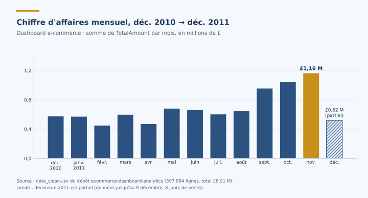

*Chiffre d'affaires mensuel du dashboard e-commerce : somme de `TotalAmount` par mois sur les 397 884 lignes nettoyées (total £8,91 M). Limite : décembre 2011 est partiel, les données s'arrêtent au 9 décembre (8 jours de vente).*

  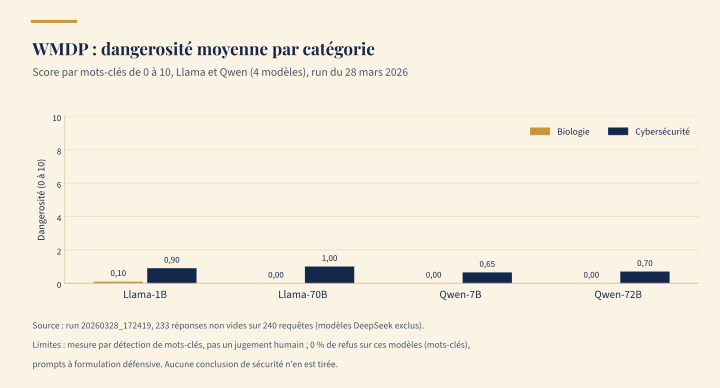

*Hackathon WMDP, run du 28 mars 2026 : dangerosité moyenne (0 à 10) des réponses de Llama-1B, Llama-70B, Qwen-7B et Qwen-72B, soit 233 réponses non vides sur 240 requêtes. Limites : le score est une détection de mots-clés, pas un jugement humain ; le 0 % de refus est lui aussi mesuré par mots-clés, sur des prompts à formulation défensive. Aucune conclusion de sécurité n'en est tirée, et les modèles DeepSeek-R1 (réponses vides) ne figurent pas dans ce graphique.*

  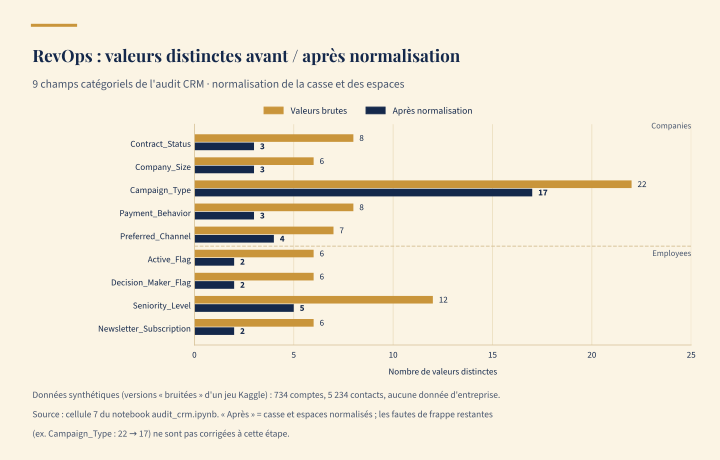

*Audit CRM : nombre de valeurs distinctes par champ catégoriel avant et après normalisation de la casse et des espaces (cellule 7 du notebook). Limite : données synthétiques (versions « bruitées » d'un jeu Kaggle), pas de données d'entreprise ; les fautes de frappe restantes ne sont pas corrigées à cette étape.*

## ▪ Stack

  

Aussi : matplotlib, TF-IDF + Random Forest, AWS (Cloud Foundations).

## ▪ Certifications

- AWS Academy Graduate, Cloud Foundations (Amazon Web Services, 2025)
- Structuring Data & Exploring GenAI Tools (OMNES Education, 2025)
- Prompt Engineering Fundamentals (Datascientest, 2024)

## ▪ Prises de parole et projets d'équipe

Interview à VivaTech (Orbite Média) · sollicitée par OMNES Education pour une interview sur l'IA · 1ère place au projet robotique en équipe.

## ▪ Contact

Je recherche une alternance en Data & IA à partir d'octobre 2026, au rythme de 3 semaines en entreprise et 2 semaines à l'école.

[LinkedIn](https://linkedin.com/in/kadi-bagayoko) · [kadibaga22@gmail.com](mailto:kadibaga22@gmail.com) · Portfolio : lien à venir

  

